 

[portfolio](https://divyamchauhan.pages.dev/) &nbsp;·&nbsp;
[linkedin](https://www.linkedin.com/in/divyamchauhan2/) &nbsp;·&nbsp;
[huggingface](https://huggingface.co/dopami9) &nbsp;·&nbsp;
[email](mailto:dpschauhandivyam@gmail.com)

> 2nd-year CSE student (9.12 GPA) and self-driven AI developer. 
> Passionate about translating complex AI tools into practical, business-ready use cases.

I architect AI workflows, test on real use cases, and focus on practical implementations. Right now I am focused on 
**Generative AI Development** — using tools like Antigravity, Claude Custom Skills, and RAG architectures. Also 
deep into full-stack development, structured technical demos, and Vibe Coding.

<samp>python &nbsp; javascript &nbsp; c++ &nbsp; sql &nbsp; mongodb &nbsp; html/css &nbsp; flask &nbsp; huggingface &nbsp; n8n</samp>

**[Concept One](https://github.com/Divyam-Chauhan/Concept-One)** &nbsp;·&nbsp; <samp>vanilla js, gsap, locomotive scroll</samp> 
A zero-framework high-performance 3D interactive web experience featuring a kinetic sequence 
of a Koenigsegg One with dynamic assembly/disassembly mechanics.

**[GitPulse](https://github.com/Divyam-Chauhan/GitPulse)** &nbsp;·&nbsp; <samp>python, rich, watchdog</samp> 
A real-time terminal dashboard and repository monitor tracking filesystem changes and 
git status parsing to visualize branch state and commit history interactively.

**[HealthSaathi](https://github.com/Divyam-Chauhan/HealthSaathi)** &nbsp;·&nbsp; <samp>python, flask, huggingface</samp> 
An AI medical assistant using Gemma-based RAG architecture. Delivers context-aware 
medical information in vernacular languages (Hindi/Bhojpuri).

